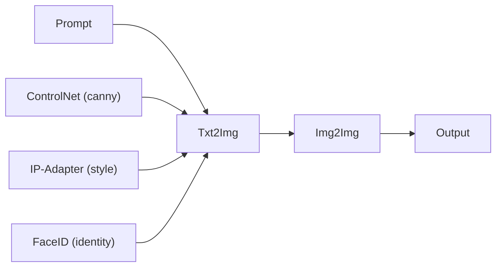
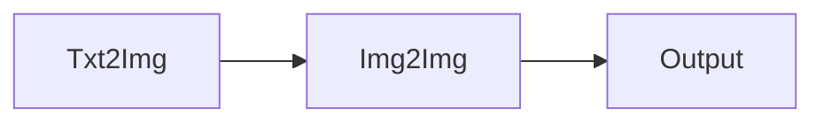
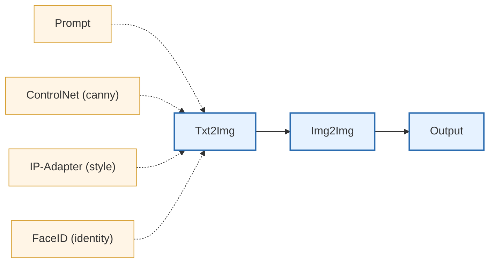

# Morphalo

Morphalo is a **local-first framework** for building reproducible **generative image and video workflows** as
**DAGs (Directed Acyclic Graphs)**.

Instead of exposing the internal components of diffusion models, Morphalo treats
complete diffusion pipelines as **high-level operators** that can be composed into
larger image-processing workflows.

Diffusers pipelines (`txt2img`, `img2img`, `inpaint`) become building blocks inside a DAG,
alongside other tools such as MediaPipe, Segment Anything, or custom preprocessing steps.

The core idea is simple:

- You describe a pipeline as a graph of nodes (e.g. `Prompt` → `Txt2Img` → `Img2Img` → `Inpaint`).
- Each node materializes its output to disk (JSON sidecars + images), making runs **inspectable** and **restartable**.
- A lightweight runner executes the graph deterministically.

Under the hood, Morphalo focuses on wiring together modern diffusion tooling (Diffusers, ControlNet, IP-Adapter, FaceID, T2I-Adapter) along with useful preprocessors (aux maps, subject crop, etc.) in a way that is **composable**, **reproducible**, and **easy to iterate on**.

> **Status:** this repository is primarily intended for personal/local use for now. Expect breaking changes.

## Why this exists

Most diffusion experiments start as a notebook or a single script.  
As pipelines grow more complex, they often turn into:

- tangled glue code
- implicit dependencies between steps
- repeated preprocessing
- runs that are difficult to reproduce or partially rerun

Morphalo was created to address these issues while preserving the **fast iteration workflow** typical of experimental diffusion projects.

At its core, Morphalo is a **Python interface built on top of Diffusers** that allows complex image generation workflows to be expressed as **explicit DAGs (Directed Acyclic Graphs)**.

In practice, this makes Morphalo a **programmable pipeline engine for generative workflows**.

This approach introduces a few key improvements:

- **Explicit pipeline structure**  
  Dependencies between steps are expressed directly in the graph wiring.

- **Artifact-based execution**  
  Every node materializes its outputs to disk, enabling caching and reproducible runs.

- **Incremental execution**  
  Individual nodes or subgraphs can be re-executed without recomputing the entire pipeline.

- **Composable conditioning**  
  Multiple conditioning signals (prompt bundles, ControlNet, IP-Adapter, FaceID, etc.) can be injected laterally into generation nodes.

- **CLI-driven workflows**  
  DAGs can be executed, inspected, and partially rerun via a simple command-line interface.

### Relationship to existing tools

Several tools already exist for building diffusion workflows, most notably **ComfyUI**, which provides a graphical node-based interface.

Morphalo takes a different approach:

- **code-first rather than UI-first**
- designed for **reproducible experimentation**
- integrates naturally into **Python workflows and scripts**
- favors **explicit configuration and version-controlled pipelines**

While ComfyUI focuses on interactive visual experimentation, Morphalo focuses on **structured and programmable pipelines**.

In particular, Morphalo operates at a **higher abstraction level** than tools such as ComfyUI.

In ComfyUI, users typically construct graphs that closely mirror the **internal structure of diffusion inference**. 
Nodes often represent low-level components of the generation process (e.g. CLIP encoders, schedulers, samplers, VAE decoding, latent transformations), 
and building a workflow means assembling these internal building blocks manually.

Morphalo instead treats diffusion models as **high-level operators** by relying directly on ready-made pipelines provided by
libraries such as Diffusers. Rather than exposing the internal model graph, Morphalo orchestrates complete generation steps such as:

- `Txt2Img`
- `Img2Img`
- `Inpaint`
- ControlNet-conditioned generation
- adapter-based conditioning (IP-Adapter, FaceID, etc.)

These operators are then combined inside a DAG to build **larger image-processing workflows**.

This makes it natural to integrate diffusion with other processing stages, for example:

- preprocessing images (cropping subjects, extracting faces, generating control maps)
- running diffusion pipelines with prompts and conditioning signals
- refining or reprocessing generated outputs

In practice, a Morphalo workflow may combine components from several libraries—such as Diffusers, MediaPipe, Segment Anything (SAM), 
or other preprocessing tools—to construct end-to-end generation pipelines driven by prompts, images, or both.

The result is a system where diffusion pipelines become **building blocks in a broader image-processing DAG**, 
rather than the graph itself.

That said, the DAG model used by Morphalo is intentionally **UI-friendly**.  
Because workflows are represented as graphs with explicit channels, it would be straightforward in the future to build a graphical editor that generates DAG definitions automatically.

## Features (high level)

- **DAG-based pipeline authoring**  
  Workflows are defined as directed acyclic graphs where each node produces
  materialized artifacts. Nodes are connected via a lightweight wiring DSL
  (`NodeRef`, `AttachmentSink`, and channel-based connections).

- **Deterministic DAG execution via CLI**  
  A CLI runner discovers DAGs at module import time and executes them
  deterministically. The runner supports full DAG execution as well as
  partial runs (single node, downstream, or forced upstream).

- **Artifact-based execution model**  
  Each node materializes its outputs to disk (images, video frames, metadata).
  JSON sidecar artifacts act as persistent checkpoints, enabling resumable
  execution and reuse of upstream outputs without recomputation.

- **Multi-channel wiring model**  
  Nodes communicate through explicit channels rather than positional inputs.
  This allows multiple forms of conditioning to be injected laterally into
  generation nodes.

  Typical lateral inputs include:

  - **Prompt bundles** injected into generation nodes
  - **ControlNet conditioning images**
  - **IP-Adapter slots** (optionally with spatial masks)
  - **FaceID conditioning** (optionally with masks and CLIP embedding injection)
  - **T2I-Adapter attachments**

- **Prompt pipeline**  
  Prompts are first-class nodes. They can be composed from structured content
  and style components, optionally translated to English, and injected into
  downstream generation nodes via a dedicated prompt channel.

- **Preprocessing nodes**  
  Several nodes prepare conditioning data for downstream models, including:
  - auxiliary maps (e.g. Canny, depth, pose)
  - subject or face cropping
  - image compositing and stacking
  - conditioning preparation for adapters.

- **Image generation nodes**  
  Support for common diffusion workflows such as:

  - `txt2img`
  - `img2img`
  - `inpaint`

  with optional ControlNet, IP-Adapter, FaceID, and T2I-Adapter conditioning.

- **Experimental video generation nodes**  
  Early support for video workflows is included (still under development):

  - `txt2video`
  - `img2video`

  These nodes integrate emerging video diffusion pipelines and will evolve as
  the ecosystem matures.

## Conceptual model

A Morphalo workflow is defined as a **directed acyclic graph (DAG)**.

Each node produces artifacts on disk and can receive inputs through
explicit channels. Nodes are connected using a wiring DSL that allows both
**main data flow** and **lateral conditioning inputs**.

### Node model

In Morphalo, each step of a workflow is represented by a **node**.

A node is a lightweight object that:

- has a unique **name** within the DAG
- receives a **spec** (configuration)
- optionally consumes artifacts produced by upstream nodes
- materializes its outputs to disk

Conceptually:

```
Node
 ├ name        (identifier within the DAG)
 ├ spec        (configuration dictionary or layered spec)
 ├ run(...)    (execution logic)
 └ artifacts   (files written to disk)
```

The `run(...)` method is responsible for executing the node's logic and
producing its artifacts. These artifacts are later consumed by downstream
nodes through the DAG wiring system.

This design keeps nodes deterministic and makes pipeline execution
inspectable and reproducible.

A typical graph might look like this:



### Main flow

The **main flow** represents the primary data transformation.

Example:



Each node consumes the artifacts produced by the previous node.

### Lateral wiring (conditioning)

Generation nodes can also receive **lateral inputs** through dedicated
channels.

These inputs do not replace the main image flow but **augment the generation
process**.

Typical examples:

- **Prompt → generation node**  
  Injects the resolved prompt bundle into the diffusion pipeline.

- **ControlNet → generation node**  
  Provides structural guidance (e.g, depth, canny edges).

- **IP-Adapter → generation node**  
  Injects style or reference-image conditioning.

- **FaceID → generation node**  
  Injects identity embeddings extracted from reference faces.

Example with lateral inputs:



> Solid edges represent the main artifact flow, while dashed edges represent lateral conditioning inputs.

### Wiring API

Nodes are connected using a small wiring DSL built around the `>>` operator.

Two main patterns exist:

**Direct wiring (main artifact flow):**

```
upstream_node >> downstream_node
```

This connects the primary artifact produced by `upstream_node` to the main
input of `downstream_node`.

**Channel wiring (lateral inputs):**

```
conditioning_node >> target_node.channel()
```

Here the upstream node is attached to a specific **input channel** exposed by
the downstream node.

These channels are implemented internally through `AttachmentSink` objects
and allow nodes to expose structured attachment points for conditioning
signals such as prompts, ControlNet inputs, or adapter references.

This distinction keeps the **main data flow explicit**, while allowing
multiple optional conditioning signals to be injected without breaking the
pipeline structure.


### Artifact-based execution

Each node writes its outputs to disk:

```
outputs/
  dag_name/
  node_id/
   image.png
   artifact.json
```

The `artifact.json` file records:

- resolved configuration
- parameters used
- produced files
- dependency information

These artifacts act as **persistent checkpoints**, allowing:

- partial DAG execution
- node-level reruns
- reuse of upstream results

without recomputing the entire pipeline.

## Repository layout (typical)

The repository is structured as a small execution engine plus optional local workspace directories.

### Core engine (version-controlled)

- `morphalo/` - Core Python package. Contains:
    - DAG engine and validation logic
    - CLI entrypoint
    - Node implementations (txt2img, img2img, inpaint, controlnet, ip_adapter, face_id, t2i_adapter, etc.)
    - Conditioning and wiring utilities

- `demo/` - Example DAGs and macro workflows (e.g. compositing, stylization, reconstruction, face pipelines). These serve as reference implementations.
- `tests/` - Unit tests (including DAG-level tests).
- `third_party/`
Wrapped or vendored utilities (e.g. controlnet aux processors, external helpers).
- `bin/` - Helper scripts (e.g. run_dag.sh).

Root-level scripts:

- `init_project.sh` – bootstrap local virtual environment
- `fetch_media_pipe.sh` – download MediaPipe task models
- `fetch_sam.sh` – download SAM checkpoints
- `requirements.txt` – Python dependencies
- `config.ini` – configuration

## Prerequisites

### System
- Linux recommended (works anywhere Python + PyTorch works).
- Python 3 (`python3 -m venv` is used by the bootstrap script).
- NVIDIA GPU strongly recommended for diffusion workloads.

### Python dependencies
All Python deps are in `requirements.txt` and include `diffusers[torch]`, `transformers`, `pyhocon`, `typer`, `mediapipe`, `insightface`, `onnxruntime`, `ultralytics`, `segment-anything-py`, etc.

### Torch / CUDA
The project bootstrap installs PyTorch wheels with CUDA runtime **cu128**.  
If you want a different CUDA version (or CPU-only), you can edit `init_project.sh`.

## Quickstart (after cloning)

From the repo root:

```bash
# 1) create a local venv + install torch + requirements
./init_project.sh

# (optional) rebuild the venv from scratch
./init_project.sh --rebuild
```

This will:

- Create `./venv`
- Install PyTorch (CUDA-enabled wheel)
- Install all dependencies from requirements.txt
- Perform a non-blocking CUDA sanity check

### Activate the environment

You can activate the virtual environment manually:

```
source ./venv/bin/activate
```

Or use the provided helper script:
```
./start_env
```

## Optional: download extra model assets

Some nodes rely on external checkpoints (e.g. MediaPipe tasks, SAM weights).
Helper scripts are provided:

```bash
# MediaPipe task files (pose/hand/face landmarker)
./fetch_media_pipe.sh

# Segment Anything checkpoints (vit_h/vit_l/vit_b)
./fetch_sam.sh
```

- MediaPipe models are placed under `~/models/mediapipe`.
- SAM models are placed under `~/models/sam`.

## Running DAGs

### CLI entrypoint

The main CLI is `morphalo.cli`. The most common command is:

```bash
python -m morphalo.cli run-dags <module> [--dag <name>] [--node <id>] [--downstream] [--force-upstream]
```

The runner discovers DAGs **at import time** via `DagRegistry`, then executes them deterministically.

### Convenience script

There is a helper script that ensures the local venv is activated and calls the CLI:

```bash
./run_dag.sh <dag-module>
```

Example:

```bash
./run_dag.sh dags.demo_img
```

This script calls `python -m morphalo.cli run-dags "$DAG_MODULE" "$@"`.

## Example: a simple txt2img DAG

Below is a minimal DAG you can drop into `dags/hello_txt2img.py`:

```python
from pathlib import Path

from morphalo.dag import DAG
from morphalo.nodes.prompt import Prompt
from morphalo.nodes.txt2img import Txt2Img

ROOT = Path(__file__).resolve().parents[1]

with DAG('hello_txt2img', out_dir=ROOT / 'outputs' / 'hello_txt2img') as dag:
    prompt = Prompt(
        name='prompt',
        spec={
            'prompt': {
                'content': [
                    'A cinematic portrait of a silver-haired mage with violet eyes.',
                    'Realistic skin texture, natural lighting.'
                ],
                'style': [
                    '35mm film look, shallow depth of field'
                ]
            },
            'negative_prompt': [
                'low quality', 'blurry'
            ],
        },
    )

    out = Txt2Img(
        name='out',
        spec={
            'model': {'id': 'stabilityai/stable-diffusion-xl-base-1.0'},
            'params': {'steps': 25, 'cfg': 5.0, 'width': 1024, 'height': 1024},
            'seed': 'random',
        },
    )

    prompt >> out.prompt()
```

Run it:

```bash
./bin/run_dag.sh dags.hello_txt2img --dag hello_txt2img
```

Outputs are written under `outputs/hello_txt2img/` (image file + JSON metadata per node).

### Direct connections vs lateral wiring

Morphalo distinguishes between two kinds of node connections.

#### Direct connection (main artifact flow)

A direct connection passes the primary output artifact of one node into
the main input of another node.

Example:

``` python
file_img >> img2img
```

Here, `img2img` receives the upstream image as its required main input.
This is the standard data flow of the DAG: one node produces the
artifact, the next node consumes it.

Use a direct connection when the downstream node requires that artifact
in order to run.

Typical examples include:

-   image source → `Img2Img`
-   image source → `Inpaint`
-   `Txt2Img` → `Img2Img`
-   `Img2Img` → `ImageStack`

#### Lateral wiring (conditioning channels)

Some nodes also expose dedicated attachment points for lateral
conditioning. These are not the main input of the node, but additional
signals that modify or guide its behavior.

Example:

``` python
prompt >> out.prompt()
```

Here, the `Prompt` node is not connected to the main input of `Txt2Img`.
Instead, it is injected through a dedicated prompt channel exposed by
`out.prompt()`.

This same pattern is used for other conditioning mechanisms such as:

-   prompt bundles
-   ControlNet inputs
-   IP-Adapter reference images
-   FaceID inputs
-   T2I-Adapter inputs

In other words:

-   **required primary data** should be passed through a direct
    connection
-   **conditioning inputs** should be attached through the node's
    dedicated lateral wiring API

For more advanced wiring patterns, see the examples in the `demo/`
directory.

## Node specification resolution

Nodes accept their configuration through the `spec` parameter.

A spec can be provided in three forms:

-   a Python dictionary
-   a path to a HOCON configuration file
-   a sequence of layered specifications combining both

Example:

``` python
spec = [
    "configs/base.conf",
    "configs/scene.conf",
    {"params": {"steps": 30}}
]
```

During execution, Morphalo resolves this specification into a single
configuration dictionary.

Resolution works as follows:

1.  Each layer is resolved independently.
    -   dictionaries are used directly
    -   strings or `Path` objects are interpreted as paths to HOCON
        files and loaded accordingly
2.  The resolved layers are then **merged from left to right**.

Later layers override earlier ones.

### Merge rules

The merge operation follows a deterministic deep-merge strategy:

-   **nested dictionaries are merged recursively**
-   **scalars override previous values**
-   **lists are replaced entirely**

Example:

Layer 1:

``` python
{
  "params": {
    "steps": 20,
    "width": 1024
  }
}
```

Layer 2:

``` python
{
  "params": {
    "steps": 30
  }
}
```

Final result:

``` python
{
  "params": {
    "steps": 30,
    "width": 1024
  }
}
```

However, lists are not merged:

Layer 1:

``` python
{
  "negative_prompt": ["blurry"]
}
```

Layer 2:

``` python
{
  "negative_prompt": ["low quality"]
}
```

Final result:

``` python
{
  "negative_prompt": ["low quality"]
}
```

This layered specification model allows base configurations to be reused
and selectively overridden for different nodes or experiments while
keeping configuration files compact and composable.

## CLI Usage and Execution Model

Morphalo is designed around a small but flexible CLI runner that executes DAGs deterministically and supports partial execution.

The main entrypoint is:

```bash
python -m morphalo.cli run-dags <module> [options]
```

Where:

- `<module>` is a Python module that defines one or more DAGs.
- DAGs are discovered at import time via the internal registry.
- Execution is handled by the DAG runner.

### Running a full DAG

If a module defines multiple DAGs, you can select one explicitly:

```bash
./bin/run_dag.sh my_dags.some_pipeline --dag my_dag_name
```

If `--dag` is omitted and the module defines only one DAG, it will be executed automatically.

### Partial execution (node-level runs)

The CLI supports Make-like execution semantics.

You can run a single node by ID:

```bash
python -m morphalo.cli run-dags my_dags.some_pipeline \
    --dag my_dag_name \
    --node out
```

This requires that all upstream nodes have already materialized their outputs on disk.

If upstream artifacts are missing, you can force their execution:

```bash
python -m morphalo.cli run-dags my_dags.some_pipeline \
    --dag my_dag_name \
    --node out \
    --force-upstream
```

You can also execute a node and everything downstream from it:

```bash
python -m morphalo.cli run-dags my_dags.some_pipeline \
    --dag my_dag_name \
    --node some_node \
    --downstream \
    --force-upstream
```

This makes it possible to:
- modify one node,
- re-run only what is necessary,
- avoid recomputing expensive preprocessing steps.

## Artifact Model (Caching & Checkpointing)

Each node materializes its output to disk.

Artifacts typically include:
- Generated image(s) or video(s)
- A JSON sidecar describing:
  - the resolved specification
  - parameters used
  - produced files
  - dependency structure

The JSON artifact is not primarily for debugging.  
It serves as a persistent checkpoint mechanism, enabling:

- deterministic re-execution,
- partial graph execution,
- reuse of upstream outputs without recomputation.

This design makes DAG execution resumable and reproducible by construction.

## Notes

- On first execution of a model, Hugging Face / Diffusers may download weights automatically.
- For best performance, use a CUDA-enabled GPU and appropriate dtype (fp16/bf16 where supported).

## License

TBD.
