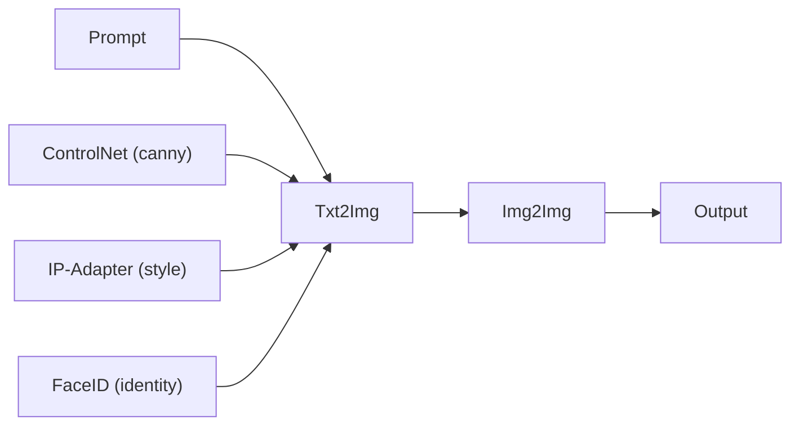
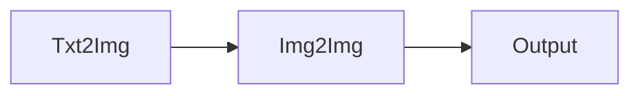
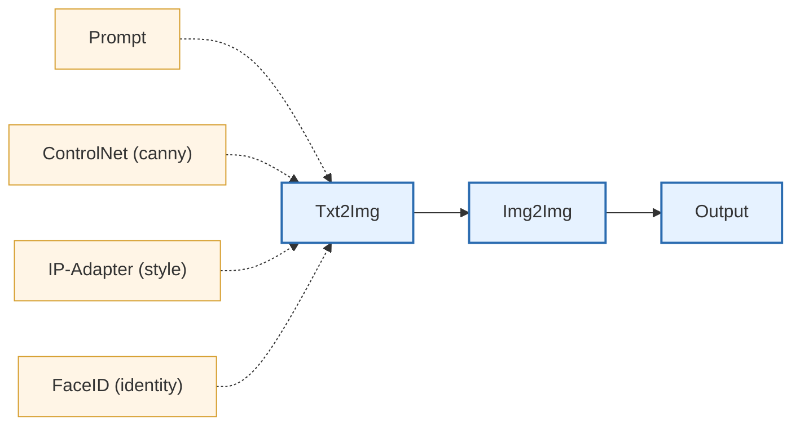

# Stability

Stability is a **local-first** playground for building **reproducible image/video generation workflows** as **DAGs** (Directed Acyclic Graphs).

The core idea is simple:

- You describe a pipeline as a graph of nodes (e.g. `Prompt` → `Txt2Img` → `Img2Img` → `Inpaint`).
- Each node materializes its output to disk (JSON sidecars + images), so runs are **inspectable** and **restartable**.
- A small runner executes the graph deterministically.

Under the hood, Stability focuses on “wiring” together modern diffusion tooling (Diffusers, ControlNet, IP-Adapter, FaceID, T2I-Adapter) plus useful preprocessors (aux maps, subject crop, etc.) in a way that is **composable** and **easy to iterate**.

> Status: this repo is intended for personal/local use first. Expect breaking changes.

## Why this exists

Most diffusion experiments start as a notebook or a single script.  
As pipelines grow more complex, they often turn into:

- tangled glue code
- implicit dependencies between steps
- repeated preprocessing
- runs that are difficult to reproduce or partially rerun

Stability was created to address these issues while preserving the **fast iteration workflow** typical of experimental diffusion projects.

At its core, Stability is a **Python interface built on top of Diffusers** that allows complex image generation workflows to be expressed as
**explicit DAGs (Directed Acyclic Graphs)**.

This approach introduces a few key improvements:

- **Explicit pipeline structure**  
  Dependencies between steps are expressed directly in the graph wiring.

- **Artifact-based execution**  
  Every node materializes its outputs to disk, enabling caching and reproducible runs.

- **Incremental execution**  
  Individual nodes or subgraphs can be re-executed without recomputing the entire pipeline.

- **Composable conditioning**  
  Multiple conditioning signals (prompt bundles, ControlNet, IP-Adapter, FaceID, etc.) can be injected laterally into generation nodes.

- **CLI-driven workflows**  
  DAGs can be executed, inspected, and partially rerun via a simple command-line interface.

### Relationship to existing tools

Several tools already exist for building diffusion workflows, most notably **ComfyUI**, which provides a graphical node-based interface.

Stability takes a different approach:

- **code-first rather than UI-first**
- designed for **reproducible experimentation**
- integrates naturally into **Python workflows and scripts**
- favors **explicit configuration and version-controlled pipelines**

While ComfyUI focuses on interactive visual experimentation, Stability focuses on **structured and programmable pipelines**.

That said, the DAG model used by Stability is intentionally **UI-friendly**.  
Because workflows are represented as graphs with explicit channels, it would be straightforward in the future to build a graphical editor that generates DAG definitions automatically.

## Features (high level)

- **DAG-based pipeline authoring**  
  Workflows are defined as directed acyclic graphs where each node produces
  materialized artifacts. Nodes are connected via a lightweight wiring DSL
  (`NodeRef`, `AttachmentSink`, and channel-based connections).

- **Deterministic DAG execution via CLI**  
  A CLI runner discovers DAGs at module import time and executes them
  deterministically. The runner supports full DAG execution as well as
  partial runs (single node, downstream, or forced upstream).

- **Artifact-based execution model**  
  Each node materializes its outputs to disk (images, video frames, metadata).
  JSON sidecar artifacts act as persistent checkpoints, enabling resumable
  execution and reuse of upstream outputs without recomputation.

- **Multi-channel wiring model**  
  Nodes communicate through explicit channels rather than positional inputs.
  This allows multiple forms of conditioning to be injected laterally into
  generation nodes.

  Typical lateral inputs include:

  - **Prompt bundles** injected into generation nodes
  - **ControlNet conditioning images**
  - **IP-Adapter slots** (optionally with spatial masks)
  - **FaceID conditioning** (optionally with masks and CLIP embedding injection)
  - **T2I-Adapter attachments**

- **Prompt pipeline**  
  Prompts are first-class nodes. They can be composed from structured content
  and style components, optionally translated to English, and injected into
  downstream generation nodes via a dedicated prompt channel.

- **Preprocessing nodes**  
  Several nodes prepare conditioning data for downstream models, including:
  - auxiliary maps (e.g. Canny, depth, pose)
  - subject or face cropping
  - image compositing and stacking
  - conditioning preparation for adapters.

- **Image generation nodes**  
  Support for common diffusion workflows such as:

  - `txt2img`
  - `img2img`
  - `inpaint`

  with optional ControlNet, IP-Adapter, FaceID, and T2I-Adapter conditioning.

- **Experimental video generation nodes**  
  Early support for video workflows is included (still under development):

  - `txt2video`
  - `img2video`

  These nodes integrate emerging video diffusion pipelines and will evolve as
  the ecosystem matures.

## Conceptual model

A Stability workflow is defined as a **directed acyclic graph (DAG)**.

Each node produces artifacts on disk and can receive inputs through
explicit channels. Nodes are connected using a wiring DSL that allows both
**main data flow** and **lateral conditioning inputs**.

A typical graph might look like this:



### Main flow

The **main flow** represents the primary data transformation.

Example:



Each node consumes the artifacts produced by the previous node.

### Lateral wiring (conditioning)

Generation nodes can also receive **lateral inputs** through dedicated
channels.

These inputs do not replace the main image flow but **augment the generation
process**.

Typical examples:

- **Prompt → generation node**  
  Injects the resolved prompt bundle into the diffusion pipeline.

- **ControlNet → generation node**  
  Provides structural guidance (e.g, depth, canny edges).

- **IP-Adapter → generation node**  
  Injects style or reference-image conditioning.

- **FaceID → generation node**  
  Injects identity embeddings extracted from reference faces.

Example with lateral inputs:



> Solid edges represent the main artifact flow, while dashed edges represent lateral conditioning inputs.

### Artifact-based execution

Each node writes its outputs to disk:

```
outputs/
  dag_name/
  node_id/
   image.png
   artifact.json
```

The `artifact.json` file records:

- resolved configuration
- parameters used
- produced files
- dependency information

These artifacts act as **persistent checkpoints**, allowing:

- partial DAG execution
- node-level reruns
- reuse of upstream results

without recomputing the entire pipeline.

## Repository layout (typical)

The repository is structured as a small execution engine plus optional local workspace directories.

### Core engine (version-controlled)

- `stability/` - Core Python package. Contains:
    - DAG engine and validation logic
    - CLI entrypoint
    - Node implementations (txt2img, img2img, inpaint, controlnet, ip_adapter, face_id, t2i_adapter, etc.)
    - Conditioning and wiring utilities

- `demo/` - Example DAGs and macro workflows (e.g. compositing, stylization, reconstruction, face pipelines). These serve as reference implementations.
- `tests/` - Unit tests (including DAG-level tests).
- `third_party/`
Wrapped or vendored utilities (e.g. controlnet aux processors, external helpers).
- `bin/` - Helper scripts (e.g. run_dag.sh).

Root-level scripts:

- `init_project.sh` – bootstrap local virtual environment
- `fetch_media_pipe.sh` – download MediaPipe task models
- `fetch_sam.sh` – download SAM checkpoints
- `requirements.txt` – Python dependencies
- `config.ini` – configuration

## Prerequisites

### System
- Linux recommended (works anywhere Python + PyTorch works).
- Python 3 (`python3 -m venv` is used by the bootstrap script).
- NVIDIA GPU strongly recommended for diffusion workloads.

### Python dependencies
All Python deps are in `requirements.txt` and include `diffusers[torch]`, `transformers`, `pyhocon`, `typer`, `mediapipe`, `insightface`, `onnxruntime`, `ultralytics`, `segment-anything-py`, etc.

### Torch / CUDA
The project bootstrap installs PyTorch wheels with CUDA runtime **cu128**.  
If you want a different CUDA version (or CPU-only), you can edit `init_project.sh`.

## Quickstart (after cloning)

From the repo root:

```bash
# 1) create a local venv + install torch + requirements
./init_project.sh

# (optional) rebuild the venv from scratch
./init_project.sh --rebuild
```

This will:

- Create `./venv`
- Install PyTorch (CUDA-enabled wheel)
- Install all dependencies from requirements.txt
- Perform a non-blocking CUDA sanity check

### Activate the environment

You can activate the virtual environment manually:

```
source ./venv/bin/activate
```

Or use the provided helper script:
```
./start_env
```

## Optional: download extra model assets

Some nodes rely on external checkpoints (e.g. MediaPipe tasks, SAM weights).
Helper scripts are provided:

```bash
# MediaPipe task files (pose/hand/face landmarker)
./fetch_media_pipe.sh

# Segment Anything checkpoints (vit_h/vit_l/vit_b)
./fetch_sam.sh
```

- MediaPipe models are placed under `~/models/mediapipe`.
- SAM models are placed under `~/models/sam`.

## Running DAGs

### CLI entrypoint

The main CLI is `stability.cli`. The most common command is:

```bash
python -m stability.cli run-dags <module> [--dag <name>] [--node <id>] [--downstream] [--force-upstream]
```

The runner discovers DAGs **at import time** via `DagRegistry`, then executes them deterministically.

### Convenience script

There is a helper script that ensures the local venv is activated and calls the CLI:

```bash
./run_dag.sh <dag-module>
```

Example:

```bash
./run_dag.sh dags.demo_img
```

This script calls `python -m stability.cli run-dags "$DAG_MODULE" "$@"`.

## Example: a simple txt2img DAG

Below is a minimal DAG you can drop into `dags/hello_txt2img.py`:

```python
from pathlib import Path

from stability.dag import DAG
from stability.nodes.prompt import Prompt
from stability.nodes.txt2img import Txt2Img

ROOT = Path(__file__).resolve().parents[1]

with DAG('hello_txt2img', out_dir=ROOT / 'outputs' / 'hello_txt2img') as dag:
    prompt = Prompt(
        name='prompt',
        spec={
            'prompt': {
                'content': [
                    'A cinematic portrait of a silver-haired mage with violet eyes.',
                    'Realistic skin texture, natural lighting.'
                ],
                'style': [
                    '35mm film look, shallow depth of field'
                ]
            },
            'negative_prompt': [
                'low quality', 'blurry'
            ],
        },
    )

    out = Txt2Img(
        name='out',
        spec={
            'model': {'id': 'stabilityai/stable-diffusion-xl-base-1.0'},
            'params': {'steps': 25, 'cfg': 5.0, 'width': 1024, 'height': 1024},
            'seed': 'random',
        },
    )

    prompt >> out.prompt()
```

Run it:

```bash
./run_dag.sh dags.hello_txt2img --dag hello_txt2img
```

Outputs are written under `outputs/hello_txt2img/` (image file + JSON metadata per node).

## CLI Usage and Execution Model

Stability is designed around a small but flexible CLI runner that executes DAGs deterministically and supports partial execution.

The main entrypoint is:

```bash
python -m stability.cli run-dags <module> [options]
```

Where:

- `<module>` is a Python module that defines one or more DAGs.
- DAGs are discovered at import time via the internal registry.
- Execution is handled by the DAG runner.

### Running a full DAG

If a module defines multiple DAGs, you can select one explicitly:

```bash
./bin/run_dag.sh my_dags.some_pipeline --dag my_dag_name
```

If `--dag` is omitted and the module defines only one DAG, it will be executed automatically.

### Partial execution (node-level runs)

The CLI supports Make-like execution semantics.

You can run a single node by ID:

```bash
python -m stability.cli run-dags my_dags.some_pipeline \
    --dag my_dag_name \
    --node out
```

This requires that all upstream nodes have already materialized their outputs on disk.

If upstream artifacts are missing, you can force their execution:

```bash
python -m stability.cli run-dags my_dags.some_pipeline \
    --dag my_dag_name \
    --node out \
    --force-upstream
```

You can also execute a node and everything downstream from it:

```bash
python -m stability.cli run-dags my_dags.some_pipeline \
    --dag my_dag_name \
    --node some_node \
    --downstream \
    --force-upstream
```

This makes it possible to:
- modify one node,
- re-run only what is necessary,
- avoid recomputing expensive preprocessing steps.

## Artifact Model (Caching & Checkpointing)

Each node materializes its output to disk.

Artifacts typically include:
- Generated image(s) or video(s)
- A JSON sidecar describing:
  - the resolved specification
  - parameters used
  - produced files
  - dependency structure

The JSON artifact is not primarily for debugging.  
It serves as a persistent checkpoint mechanism, enabling:

- deterministic re-execution,
- partial graph execution,
- reuse of upstream outputs without recomputation.

This design makes DAG execution resumable and reproducible by construction.

## Notes

- On first execution of a model, Hugging Face / Diffusers may download weights automatically.
- For best performance, use a CUDA-enabled GPU and appropriate dtype (fp16/bf16 where supported).

## License

TBD.
